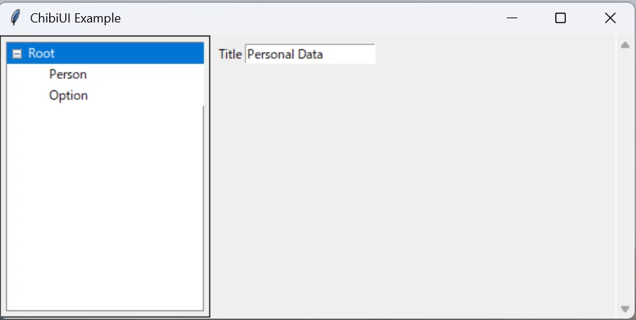

# ChibiUI

ChibiUI is a tiny GUI framework that sits on top of Python’s built‑in Tkinter. Just copy a single file (ChibiUI.py) into your project and you’ll have a modern window with tree‑style navigation and a handy set of widgets—no event‑loop boilerplate needed.

✨ Features
- Data‑entry forms and parameter dialogs
- Lightweight GUI wrappers around CLI tools
- Tree Navigation
- Tkinter ships with Python; no extra packages required.

## 🚀 Quick Start
~~~ python
from ChibiUI import ChibiUI
ui = ChibiUI("ChibiUI Example")
ui.add_textbox("/Title", "Personal Data")

# Navigation tree items are automatically created from the path
ui.add_textbox("Person/Name", "John Doe")
ui.add_selector("Person/Gender", ["Male", "Female", "Other"], "Male")
ui.add_slider("Person/Age", 0, 100, 1, 30)
ui.add_checkbox("Person/Add File", True)
ui.add_browse_file("Person/Select File")
ui.add_button("Person/Submit", False)

ui.add_textbox("Option/Country", "Japan")

while ui.alive: # Main loop to keep the UI running
    if ui.get("Person/Submit"): # Check if the button is pressed
        print("Submit button pressed!")
        print("Title:", ui.get("/Title"))

        print("-- Personal Info --")
        print("Name:", ui.get("/Person/Name"))
        print("Gender:", ui.get("/Person/Gender"))
        print("Age:", ui.get("/Person/Age"))
        print("Select File:", ui.get("/Person/Select File"))
        print("Country:", ui.get("/Option/Country"))
        print("---")

        ui.set("/Person/Submit", False) # Reset the button value
    
    # Add a small delay to prevent high CPU usage
    time.sleep(0.01)

print('End')
~~~ 

